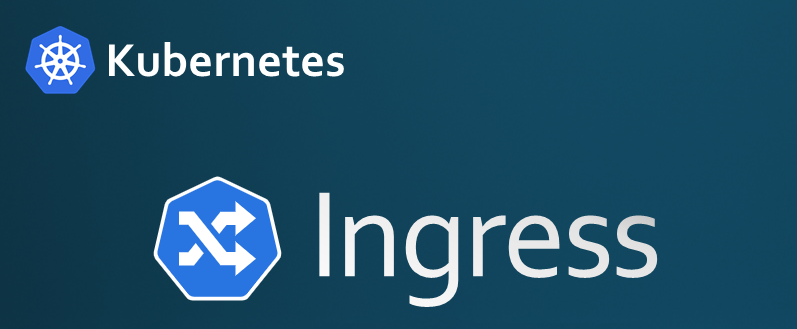
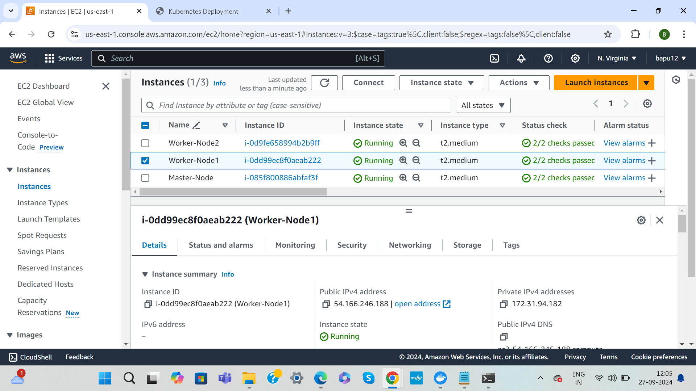
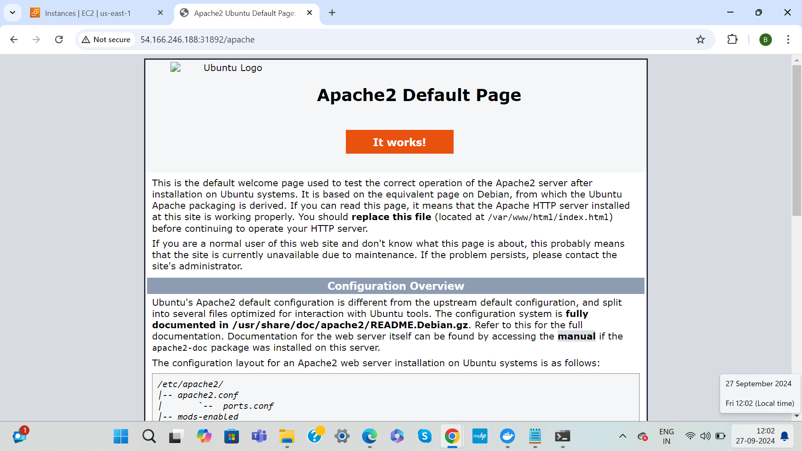
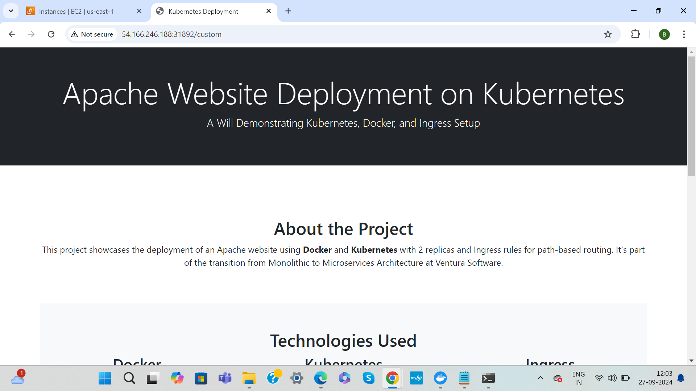
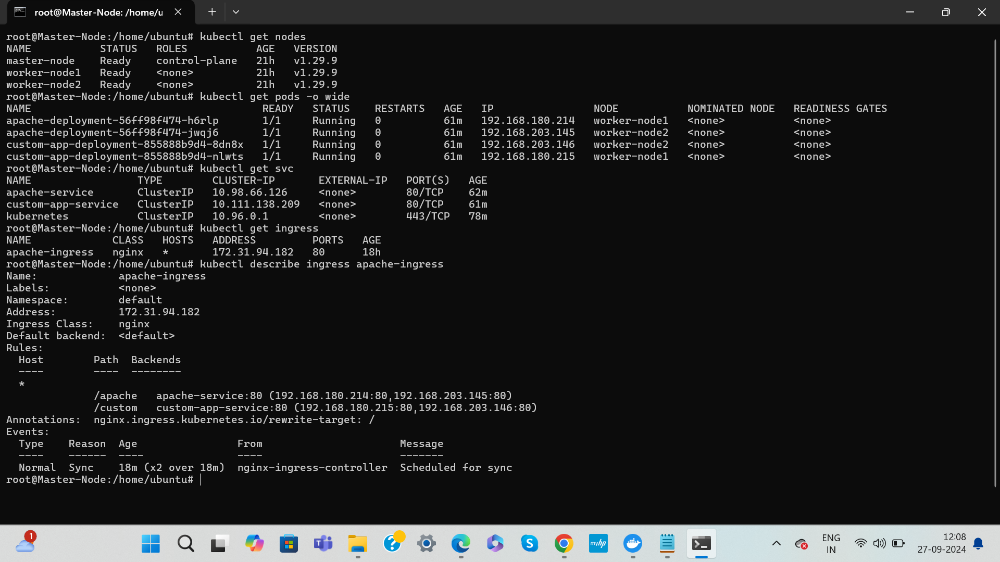

# Deploying Apache Application and Custom App on Kubernetes  Using Ingress




## Overview
This README provides a comprehensive guide to deploying an Apache application and Custom APP on Kubernetes with Ingress routing. The deployment will consist of two replicas of an Apache server and an additional custom application, all hosted on Amazon EC2 instances.

## Prerequisites
- **AWS Account**: You will need an active AWS account to create EC2 instances.
   
   - ***Create 3 EC2 Instances*** 
        
        1. Master-Node               
        2. Worker-Node1
        3. Worker-Node2 

# Steps to Complete Setup and Deploy

## Step 1: Create EC2 Instances
1. **Login to AWS Management Console** and navigate to the EC2 Dashboard.
2. **Launch EC2 Instances**:
   - Choose an Amazon Machine Image (AMI) (e.g., Ubuntu Server 20.04 LTS).
   - Select an instance type (e.g., `t2.medium`).
   - Configure instance details (default settings are usually fine).
   - Add storage as needed (Minimum 20 GB ).
   - Configure Security Group:
     - Create a new security group with the following rules:
       - **Type**: SSH | **Protocol**: TCP | **Port Range**: 22 | **Source**: Your IP
       - **Type**: HTTP | **Protocol**: TCP | **Port Range**: 80 | **Source**: Anywhere
       - **Type**: All Traffic | **Protocol**: TCP | **Port Range**: All | **Source**: Anywhere (for testing purposes)
   - Review and launch the instances, ensuring you select a key pair for SSH access.

3. **Note the Public IPs** of the instances created.

## Step 2: Connect to EC2 Instances

### 1. Open your terminal and connect to your EC2 instances using SSH:

```bash
ssh -i <key-pair-file-path> ubuntu@<public-ip-of-instance>
```

## Step 3: Install Required Tools (on Master & Worker Nodes)

### 1. Install Docker:

```bash
sudo apt update 
sudo apt install -y docker.io
```

### 3. Install CRI-Docker : (Container Runtime Interface) It allows Kubernetes to communicate with Docker for creating and managing containers

```bash
sudo wget https://raw.githubusercontent.com/lerndevops/labs/master/scripts/installCRIDockerd.sh -P /tmp

sudo chmod 755 /tmp/installCRIDockerd.sh

sudo bash /tmp/installCRIDockerd.sh

sudo systemctl restart cri-docker.service
```

### 4. Add google apt key to verify releases:
```bash
curl -s https://packages.cloud.google.com/apt/doc/apt-key.gpg | sudo apt-key add -

sudo apt-get install -y apt-transport-https ca-certificates curl gpg

sudo apt-get install gpg
```

### 5. Install Kubernetes Components:

```bash
#add the Kubernetes package repository.

sudo mkdir -p -m 755 /etc/apt/keyrings

#Once added the package repository, update package lists and install kubeadm, kubelet, and kubectl

echo "deb [signed-by=/etc/apt/keyrings/kubernetes-apt-keyring.gpg] https://pkgs.k8s.io/core:/stable:/v1.30/deb/ /" | sudo tee /etc/apt/sources.list.d/kubernetes.list

curl -fsSL https://pkgs.k8s.io/core:/stable:/v1.30/deb/Release.key | sudo gpg --dearmor -o /etc/apt/keyrings/kubernetes-apt-keyring.gpg

sudo apt update
sudo apt install -y kubelet kubeadm kubectl
sudo apt-mark hold kubelet kubeadm kubectl
```

### 6. Disable Swap:

```bash
#effectively manage and allocate resources, providing a more stable and predictable environment for running containerized applications

sudo swapoff -a
sudo sed -i '/ swap / s/^\(.*\)$/#\1/g' /etc/fstab
```

### 7. Validate all Tools

```bash
docker -v
cri-dockerd --version
kubeadm version -o short
kubelet --version
kubectl version --client
```
## Step 4. Initialize kubernetes Master Node (Run only on Master Node)

```bash
sudo kubeadm init --cri-socket unix:///var/run/cri-dockerd.sock --ignore-preflight-errors=all

sudo mkdir -p $HOME/.kube
sudo cp -i /etc/kubernetes/admin.conf $HOME/.kube/config
sudo chown $(id -u):$(id -g) $HOME/.kube/config
```

### 1. Istall Networking Drive (Weave/flannel/calico etc...)

```bash 
kubectl apply -f https://raw.githubusercontent.com projectcalico/calico/v3.24.1/manifests/calico.yaml
```

### 2. Run on Master Node to get join token (on Master)

```bash 
kubeadm token create --print-join-command
```

### 3. Run Below Command on Worker Node to Join with Master (on Worker Node)
Note : copy the kubeadm join token from master & ensure to add --cri-socket unix:///var/run/cri-dockerd.sock as below & ensure to add sudo then run on worker nodes

```bash
Ex: sudo kubeadm join 10.128.15.231:6443  --token mks3y2.v03tyyru0gy12mbt \
           --discovery-token-ca-cert-hashsha256:3de23d42c7002be0893339fbe558ee75e14399e11f22e3f0b34351077b7c4b56 --cri-socket unix:///var/run/cri-dockerd.sock
```

## Step 5. Validate the Kubernetes is Up and Running (Master Node)

```bash
kubectl get nodes
```

## Step 6. Containerize the Given Application and Deploy (on Master Node)

### 1.Clone the GitHub Repository
```bash
git clone https://github.com/Bapugouda-B/Apache-K8s-Ingress-Demo
cd Apache-K8s-Ingress-Demo
```

### 2. Create a Docker Image, Login and Push to Docker Hub
```bash
cd website

docker build -t <your_dockerhub_username>/any-name:latest .

docker login

docker push <your_dockerhub_username>/any-name:latest

```

## Step 7. Deploy Igress Controller (On Master Node)
```bash
kubectl apply -f https://raw.githubusercontent.com/kubernetes/ingress-nginx/controller-v1.3.0/deploy/static/provider/baremetal/deploy.yaml
```

## Step 8. Kubernetes Manifest Creation and Deploying

### 1. Create Kubernetes Deployment & Service for Apache & Custom App
```bash 
# refer github repo for deployment configuration file
vi apache-deployment.yaml
kubectl apply -f apache-deployment.yaml

vi custom-app-deployment.yaml
kubectl apply -f custom-app-deployment.yaml
```

### 2. Create Ingress Rules
```bash
# refer github repo for ingress rules file
vi ingress.yaml
kubectl apply -f ingress.yaml
```

## Step 9. Verify the Deployments and Services

### 1. Check the status of the pods:
```bash
kubectl get pods
```
### 2. Check the services:
```bash
kubectl get svc
```
### 2. Check the Ingress:
```bash
kubectl get ingress
# Igress address should be assigned with Ip address. 

# If not assigned then run below command and check the type of "ingress-nginx-controller" is "LoadBalancer" or Not.


kubectl get svc -n ingress-nginx
# if type is not "LoadBalancer" then run below command and change the type=NodePort or ClusterIP to type=LoadBalancer

kubectl edit svc ingress-nginx-controller -n ingress-nginx
# change, type=LoadBalancer
```

## 10. Access the Application
```bash
http://<node-ip>:<ingress-nodeport>/apache
http://<node-ip>:<ingress-nodeport>/custom

# get <ingress-nodeport> by running below command
kubectl get svc -n ingress-nginx
```

If everything is set up correctly, you should see the website running on above endpoints.

## Project Demo







